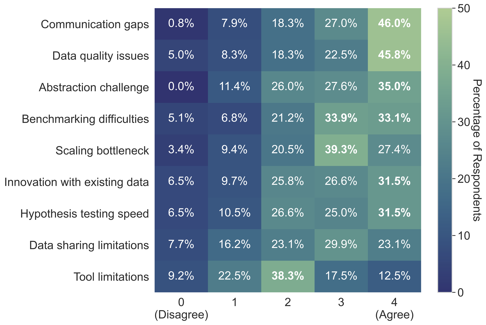

# 2025 Survey Methodology and Results

## Survey Design and Administration

To validate the computational challenges identified through interdisciplinary discussions, we surveyed 131 applicants to the CompMotifs "Hack the Sciences" London event. Respondents rated the severity of nine computational challenges within their respective fields using a 5-point Likert scale (0 = Disagree, 4 = Agree). Response counts varied between 117-126 participants per question.

## Survey Questions

The survey probed specific computational motifs through the following statements:

1. **Communication gaps**: "Interdisciplinary communication gaps significantly hinder progress in computational research"
2. **Data quality issues**: "Insufficient high-quality data holds back machine-learning approaches in my field"
3. **Abstraction challenge**: "Choosing the right level of abstraction (e.g., simulating every component explicitly vs more coarse-grained representations) is a major challenge for my field"
4. **Benchmarking difficulties**: "Unclear or incomplete metrics for system performance (e.g. benchmarks) make it challenging to develop and compare novel methods"
5. **Scaling bottleneck**: "Scaling to relevant system sizes is a bottleneck in my field"
6. **Innovation with existing data**: "We should innovate (new algorithms/theories, etc.) with the data we have — more data will always be generated and research efforts should be focussed on making the most of what we've got"
7. **Hypothesis testing speed**: "The slow, step-by-step process of testing hypotheses (experimentally and/or computationally) severely limits innovation in my field"
8. **Data sharing limitations**: "High quality data exists, but insufficient sharing of it limits my field"
9. **Tool limitations**: "My field is not held back by lack of understanding but by lack of corresponding computational tools"

## Results Visualization

Survey responses presented as a horizontal stacked bar chart, with questions ranked by mean severity score (descending order). Each bar shows the percentage distribution across the five agreement levels, with darker green indicating stronger agreement. The visualization demonstrates broad consensus on interdisciplinary communication gaps (mean: 3.10/4) and data quality issues (mean: 2.96/4) as primary challenges, while tool limitations ranked lowest (mean: 2.02/4).
